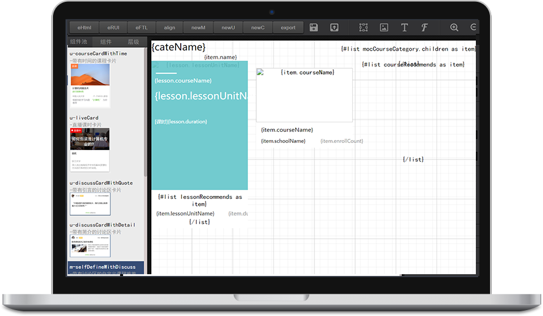

## CMP = Core Mapping Pages
it's a tool to generate pages, but not limit to page. it can also generate component(UI), module, cache and so on.you can easily make static page with this tool without typing any HTML code or css code or JavaScript code. 

CMP是一个用于制作网页的工具，你可以用它来制作静态网页，也可以制作网页片段比如一个组件，一个UI，或者一个模块，甚至是一个包含数据请求的模块，它能根据你的需求灵活的实现任何事情。

## 约定
1. 命名
  组件默认m-xxx-, UI默认u-xxx-, cache默认c-xxx-。其中最外层父元素默认m/u/c-xxx-container, 后面的-container是提取标志，提取前面的m/u/c-xxx部分作为整个组件的name。导出和保存时默认以该名称命名。
2. 定位采用相对定位+绝对定位的方式布局。目前仅支持container元素相对定位，其他元素都需要相对于container元素的绝对定位。默认创建的container元素将在输出时作为当前编辑所有元素的公共父元素，采用 align 功能时，也是基于该元素对齐到top:0px,left:0px的位置，主要是为了方便依据视觉稿来计算定位。
3. 模块或者组件UI如果是导出regular，默认导出三个文件，component.js component.html component.css
4. UI导出FTL则默认导出依据container提取的name.ftl和name.scss
5. Cache默认导出 component.js component.html component.css 和cache.js ,其中component.js中会自动注入cache请求，可以作为主UI在页面中使用，通过页面的page.js来支配。

## 规范
1. 支持组件通过函数来嵌套，但是不建议嵌套台多层次，如果需要，建议拆分成子UI来做。

## 局限性
1. 目前还只能制作组件UI，不能制作复杂嵌套的页面。目前仅支持container元素相对定位，其他元素都需要相对于container元素的绝对定位。

## 使用介绍

如上图所示，你可以创建一个模块或者UI或者Cache,然后在container中添加图片或者文字等元素，并在右侧控制该元素对应的属性。

## feature
1. 支持组件、UI、cache的保存和导出，可以把制作好的页面保存成.cmp格式的文件，使用的时候只要导入即可
2. 支持hover组件，很容易制作出各种hover组件
3. 支付FTL语法嵌套，可以使用include、IF、FOR语句，配合子组件使用。支持FTL导出，导出为依据container提取的name.ftl和name.scss
4. 支持Regular 组件导出，导出文件为component.js component.html component.scss

